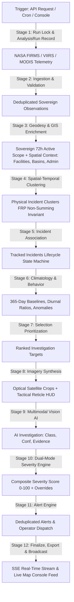
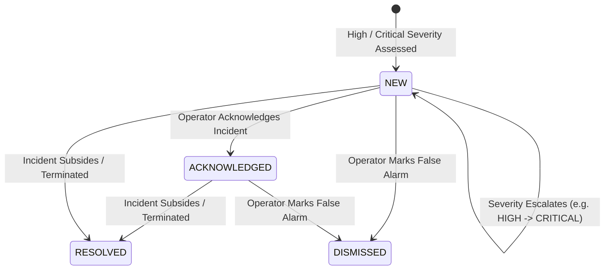
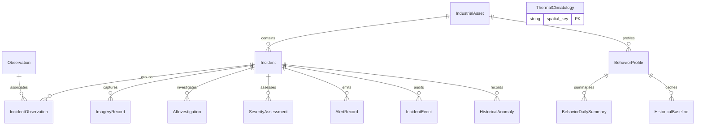

# FIREX v2 — System Logic & Algorithmic Specification
**AI-Enabled Geospatial Industrial Fire & Persistent Thermal Source Intelligence Platform**  
*SIH 2026 Problem Statement 162 (NTRO Mandate) • Sovereign Defense-Grade Architecture*

---

## 1. Executive Summary & Purpose

The **FIREX v2** platform is a sovereign, automated intelligence system designed to solve a fundamental deficiency in space-borne thermal surveillance:

> **NASA FIRMS detects thermal radiance anomalies (infrared heat spikes), NOT confirmed industrial emergencies.**

Operational command centers, defense monitoring agencies, and environmental regulators face overwhelming false-alarm fatigue caused by:
1. Routine operational refinery and petrochemical flare stacks.
2. Metallurgical blast furnaces, coking batteries, and slag heaps.
3. Open-cast coal seam fires, excavation thermal radiance, and overburden dumps.
4. Seasonal agricultural crop residue (stubble) burning.

**FIREX v2** transforms raw satellite telemetry into **explainable, trackable, and prioritized industrial incidents** by executing an autonomous multi-stage intelligence loop combining geodesy, spatial-temporal clustering, long-term satellite climatology, optical satellite verification with tactical reticle overlays, multimodal AI vision, dual-mode severity scoring, and exactly-once alert deduplication.

---

## 2. Fundamental System Invariants (Core Rules)

Any AI or automated agent operating within or reasoning about FIREX v2 MUST strictly preserve the following six invariants:

| Invariant | Name | Operational Rule |
| :--- | :--- | :--- |
| **INV-1** | **Satellite Radiance $\neq$ Disaster** | A raw FIRMS observation is merely an infrared anomaly vector. It must NEVER be treated as an uncontrolled industrial fire without multimodal verification. |
| **INV-2** | **FRP Non-Summation Rule** | Fire Radiative Power (FRP in MW) across multi-pixel clusters **MUST NEVER BE SUMMED**. Summing FRP artificially inflates physical energy flux. Clusters compute $\max(FRP)$, $\text{mean}(FRP)$, and $\min(FRP)$. |
| **INV-3** | **Sovereign Territorial Boundary** | Telemetry falling outside the sovereign terrestrial boundary and airspace of India ($68.7^\circ\text{E} - 97.4^\circ\text{E}$, $8.4^\circ\text{N} - 37.6^\circ\text{N}$ plus high-fidelity polygon mask) is quarantined or discarded. |
| **INV-4** | **Routine Flare Climatological Suppression** | Persistent flares with $\ge 10$ active days/year operating within their empirical 365-day 95th-percentile ($P_{95}$) baseline envelope are marked as `ROUTINE_FLARE` and clamped to low severity scores ($\le 20.0$). |
| **INV-5** | **New Hotspot Non-Penalization** | New incidents lacking historical baselines must NEVER be penalized with zero scores. Dual-mode scoring models dynamically substitute baseline deviation with calibrated physical intensity. |
| **INV-6** | **Monotonic Alert Escalation** | An alert is emitted **only once** for a given incident unless its severity rank strictly escalates (e.g., $\text{HIGH} \to \text{CRITICAL}$), preventing notification spamming. |

---

## 3. High-Level Architecture & End-to-End Pipeline DAG

The master pipeline executes twelve discrete stages in a directed acyclic graph (DAG). The twelve are the numbered steps of `execute_analysis_pipeline` in `backend/app/orchestration/pipeline.py`: run lock, ingestion, GIS enrichment, spatial-temporal clustering, incident association, baseline refresh, selection, imagery synthesis, multimodal vision AI, severity, alerts, and export/broadcast.



Two further concerns are cross-cutting and are not stages of this DAG: the storage foundation (SQLite fallback schema and engine, `app/storage/`) and the HTTP hardening boundary (rate-limit middleware and the global exception handler, `app/core/ratelimit.py`, registered at `app/main.py:40` and `app/main.py:43` respectively). They are exercised by `tests/test_stage0_foundation.py` and `tests/test_stage10_hardening.py` respectively, which is where the repository's `stage0`/`stage10` filenames come from.

### Stage Summary Matrix

| Stage | Subsystem | Input | Output | Primary Invariant / Logic |
| :---: | :--- | :--- | :--- | :--- |
| **1** | Run Lock & Run Record | Trigger (API / cron / request) | `AnalysisRun` audit row | Thread-safe mutex, single-run guarantee, HTTP 409 on contention |
| **2** | Ingestion & Telemetry | Live FIRMS API / CSV | Validated `Observation` records | SHA-256 deduplication, sovereign coordinate filter |
| **3** | GIS & Geodesy | Coordinates $(\phi, \lambda)$ | Sovereign 72h active scope + spatial context | Ray-casting PIP, Mining basin index, Admin boundaries |
| **4** | Clustering | Active observations (72h) | Physical clusters | Spatio-temporal reachability ($1500\text{m}, 24\text{h}$), FRP max/mean/min only, no sum |
| **5** | Incident Association & Lifecycle | Clusters | `Incident` entities | Association methods, lifecycle state machine |
| **6** | Behavior & Climatology | Incident history / Asset | `ThermalClimatology`, Baseline | 365d percentiles ($P_{50}, P_{90}, P_{95}$), Night ratio |
| **7** | Selection | Active incidents | Prioritized candidate list | Dual-mode priority, mandatory overrides, bounded candidate pool |
| **8** | Imagery Synthesis | Selected candidate | Optical crop + reticle HUD | Zoom-selected crop, physical-meter range rings, scale bar |
| **9** | Multimodal Vision AI | Visual crop + Context JSON | `AIInvestigation` record | 12 Prompt rules, Key pool rotation, Schema enforcement |
| **10** | Severity Engine | Investigation + Context | `SeverityAssessment` record | Dual-mode severity model, 4 operational overrides |
| **11** | Alert Engine | Severity assessment | `AlertRecord` | Exactly-once suppression, escalation triggers |
| **12** | Finalize, Export & Broadcast | Whole incident queue | SSE events, Console feed JSON | Severity sweep over the displayable queue; JSON feed export written per file through `_write_json_atomic` (temp file + `os.replace`, so it is atomic) |

The repository's `tests/test_stageN_*.py` filenames use an older eleven-way subsystem grouping (0 foundation, 1 ingestion, 2 GIS, 3 clustering & lifecycle, 4 behaviour, 5 selection & imagery, 6 AI, 7 severity & alerts, 8 orchestration, 9 console data, 10 hardening), which merges several of the stages above. Where this document or `docs/` refers to a numbered "stage", the twelve-stage numbering in this table is the one meant.

---

## 4. Mathematical Formulations & Quantitative Logic

### 4.1 Geodesy & Spatial Mathematics

#### Spherical Haversine Distance
Given two coordinates $P_1(\phi_1, \lambda_1)$ and $P_2(\phi_2, \lambda_2)$ in radians, the great-circle distance $d$ in kilometers ($R_{earth} = 6371.0\text{ km}$) is:

$$\Delta \phi = \phi_2 - \phi_1, \quad \Delta \lambda = \lambda_2 - \lambda_1$$

$$a = \sin^2\left(\frac{\Delta \phi}{2}\right) + \cos(\phi_1)\cos(\phi_2)\sin^2\left(\frac{\Delta \lambda}{2}\right)$$

$$d = 2 R_{earth} \cdot \arcsin\left(\min(1.0, \sqrt{a})\right)$$

#### Ray-Casting Point-in-Polygon (PIP)
For a coordinate $(\lambda_p, \phi_p)$ and a polygonal ring of $N$ vertices $[(\lambda_0, \phi_0), \dots, (\lambda_{N-1}, \phi_{N-1})]$:
A horizontal ray is cast from $(\lambda_p, \phi_p)$ eastward. For each edge $i \to j$:

$$\text{intersects} = \left( (\phi_i > \phi_p) \neq (\phi_j > \phi_p) \right) \land \left( \lambda_p < \frac{(\lambda_j - \lambda_i)(\phi_p - \phi_i)}{\phi_j - \phi_i} + \lambda_i \right)$$

Containment $\text{inside} = \text{odd count of edge intersections}$.

---

### 4.2 Indian Satellite Climatology & FRP Normalization

#### Sovereign Indian FIRMS Baseline Constants
Calibrated empirically across **2,895,064 sovereign Indian FIRMS observations** (`SELECT COUNT(*) FROM observations` on `backend/data/firex_v2.db`).

$$\begin{aligned}
P_{50} \text{ (National Median)} &= 4.05\text{ MW} \\
P_{90} \text{ (Top 10\% Intensity)} &= 13.32\text{ MW} \\
P_{95} \text{ (Top 5\% Intensity)} &= 20.81\text{ MW} \\
P_{99} \text{ (Extreme Disaster Tier)} &= 64.49\text{ MW}
\end{aligned}$$

#### Raw Log2 FRP Normalization
Maps continuous FRP (MW) to a $0 - 100$ scale:

$$S_{FRP}(FRP) = \min\left(100.0, \, 25.0 \cdot \log_2(FRP + 1.0)\right)$$

#### Sovereign Indian Calibrated FRP Normalization
Anchors the median to the boundary between Low and Medium severity:

$$S_{FRP\_calib}(FRP) = \min\left(100.0, \, 25.0 \cdot \log_2\left(\frac{FRP}{4.05} + 1.0\right)\right)$$

- $FRP = 4.05\text{ MW} \implies S = 25.0$ (Low/Medium threshold)
- $FRP = 13.32\text{ MW} \implies S = 52.5$ (High threshold)
- $FRP = 20.81\text{ MW} \implies S = 65.4$ (High tier)
- $FRP \ge 64.49\text{ MW} \implies S = 100.0$ (Critical disaster tier)

The four constants are implemented verbatim at `backend/app/severity/scoring.py:49-52`, under a comment stating the corpus they were measured over — "Measured across the 2,895,064 Indian observations held in the national archive" — which is the same row count this section quotes above, so code and specification now agree.

---

### 4.3 Spatial-Temporal Clustering (Stage 4)

Observations $\mathcal{O} = \{o_1, o_2, \dots, o_n\}$ are partitioned into clusters $\mathcal{C}_k$ using spatial reachability $\epsilon_s = 1500\text{ meters}$ and temporal window $\tau = 24.0\text{ hours}$ (`backend/app/incidents/clustering.py:112-113`; the pipeline passes both explicitly in its own `cluster_observations(active_obs, spatial_eps_meters=1500.0, time_window_hours=24.0)` call, and `POST /api/incidents/cluster-sync` defaults to the same pair at `backend/app/api/incidents.py:139-140`):

$$\text{reach}(o_i, o_j) \iff d_H(o_i, o_j) \le \epsilon_s \quad \land \quad |t(o_i) - t(o_j)| \le \tau$$

#### Strict Invariant Aggregation
For each cluster $\mathcal{C}_k = \{o_1, \dots, o_m\}$:

$$\begin{aligned}
FRP_{max} &= \max_{i=1 \dots m} o_i.frp \\
FRP_{mean} &= \frac{1}{m} \sum_{i=1}^m o_i.frp \\
FRP_{min} &= \min_{i=1 \dots m} o_i.frp \\
\mathbf{FRP_{sum}} &\mathbf{\text{ is BANNED (never computed or stored)}} \\
\bar{\phi} &= \frac{1}{m} \sum_{i=1}^m o_i.\phi, \quad \bar{\lambda} = \frac{1}{m} \sum_{i=1}^m o_i.\lambda \\
R_{footprint} &= \max\left(500.0, \, \max_{i=1 \dots m} d_H((\bar{\phi}, \bar{\lambda}), (o_i.\phi, o_i.\lambda)) \times 1000.0 + 375.0\right)
\end{aligned}$$

`FRP_max` is what the console feed publishes, under the key `cluster_max_frp`; the same value is also exported as `frp`. Both entries are written from the same source field, `inc.current_max_frp`, in `generate_console_feed_data` (`backend/app/orchestration/pipeline.py`, the `"cluster_max_frp": inc.current_max_frp` and `"frp": inc.current_max_frp` lines). There is no total-FRP field in the payload. `FRP_max`, `FRP_mean` and `FRP_min` are the only FRP aggregates `backend/app/incidents/clustering.py:55-57` computes.

> **Not a stage parameter:** $\epsilon_s = 1500\text{ m}$ is the pipeline's clustering reachability only. It is unrelated to the 25 km grouping radius used by the legacy map-preparation script `frontend/prepare_map_data.py:366`, which buckets detections for display and is not part of `execute_analysis_pipeline`.

---

### 4.4 Behavior Intelligence & Historical Anomaly (Stage 6)

#### Statistical Percentiles
For a location grid cell ($0.02^\circ \approx 2.2\text{ km}$, `backend/app/gis/spatial.py:25` `CLIMATOLOGY_GRID_DEGREES`, quantised by `climatology_cell` at `spatial.py:142-143`) or registered facility over a 365-day rolling window:
- $\text{active\_days}$: Number of distinct calendar days with thermal hits.
- $\text{night\_ratio} = \frac{\text{count}(daynight = \text{'NIGHT'})}{\text{total observations}}$. The stored `daynight` domain is `'DAY'`/`'NIGHT'`, written by `backend/app/ingestion/normalizer.py:87`; raw FIRMS single letters (`D`/`N`) are normalised on ingest and never reach the database (`backend/app/behavior/persistence.py:49` counts `== "NIGHT"`).
- $\text{persistence\_score} = \min\left(1.0, \, \frac{\text{active\_days}}{45.0} \times 0.7 + \min(1.0, \frac{\text{obs\_count}}{100.0}) \times 0.3\right)$.
- $\text{history\_reliability}$:

$$\text{Reliability} = \begin{cases} 
0.0 \text{ ('NONE')}, & \text{obs} = 0 \\
0.25 \text{ ('LOW')}, & 1 \le \text{obs} \le 4 \\
0.50 \text{ ('MODERATE')}, & 5 \le \text{obs} \le 9 \\
0.75 \text{ ('GOOD')}, & 10 \le \text{obs} \le 19 \\
1.00 \text{ ('STRONG')}, & \text{obs} \ge 20
\end{cases}$$

#### Window Length: One Requirement, Three Shorter Callers

The 365-day window above is the requirement, and the code honours it where the baseline is authored: the pipeline's Stage 6 refresh calls `get_or_create_facility_baseline(..., window_days=365)` and `get_or_create_location_baseline(..., window_days=365)` (the Stage 6 loop of `execute_analysis_pipeline` in `backend/app/orchestration/pipeline.py`), and the parameter's own default is 365 (`backend/app/behavior/baseline.py:148`). Three read paths still request a 90-day horizon when they build a baseline that is not already cached:

| Path | Call | Line |
| :--- | :--- | :--- |
| Selection engine | `window_days=90` | `backend/app/selection/engine.py:90`, `:92` |
| Investigation package | `window_days=90` | `backend/app/imagery/package.py:80`, `:82` |
| History API | `window_days: int = Query(90, ...)` | `backend/app/api/history.py:40`, `:68`, `:166`, `:187` |

This is a deliberate divergence kept, not an oversight: the cache lookup is keyed on `spatial_key` alone (`baseline.py:181-184`), so a profile already written by a Stage 6 refresh is returned intact regardless of the horizon the caller asked for, and the 90-day request only bites on a cold cell. Callers that want a shorter horizon are entitled to one — the history endpoints expose it as a query parameter on purpose. Read a baseline's own `window_days` column before comparing two of them.

#### Grid Convention: A 0.02° Requirement With a 0.01° Reader (Documented Divergence)

The 0.02° cell above is realised by `climatology_cell`, and the offline producer walks every observation through it (`backend/scripts/build_thermal_climatology.py:179`). The behavior layer's climatology lookup does not: `get_or_create_location_baseline` builds its key with `generate_spatial_key(lat, lon)` (`backend/app/behavior/baseline.py:136`, `:163`), whose default `precision=2` rounds to a hundredth of a degree, and queries `thermal_climatology` with that key (`baseline.py:236-240`). A 0.01° key matches a 0.02° row only where the two lattices coincide, so the conventions must be reconciled before this section's 0.02° requirement is binding on the read path; the console-feed reader `_read_cached_location_baseline` already takes the 0.02° side, keying its `thermal_climatology` query with `climatology_cell` (`backend/app/orchestration/pipeline.py`, the `_, _, spatial_key = climatology_cell(lat, lon)` line). The deployed table is on the 0.01° grid — all 331,418 keys are exact hundredths, and only 82,581 of them (24.9%) fall on the 0.02° lattice, so 248,837 rows are unreachable from a 0.02° lookup — which is consistent with the 0.01° reader and with a table built before the 0.02° producer, and means it must be rebuilt for the requirement to hold.

#### Historical Anomaly Score Table
Ratio against empirical median $R_{frp} = \frac{FRP_{current}}{\max(1.0, Median_{FRP})}$:

| Ratio Range | Anomaly Score | Interpretation |
| :---: | :---: | :--- |
| $\le 1.0\times$ | **0** | Sub-baseline or normal operational intensity |
| $> 1.0 - 1.25\times$ | **10** | Negligible thermal drift |
| $> 1.25 - 1.5\times$ | **20** | Minor elevated process flaring |
| $> 1.5 - 2.0\times$ | **40** | Notable thermal excursion |
| $> 2.0 - 3.0\times$ | **60** | Significant anomaly (exceeds routine fluctuation) |
| $> 3.0 - 4.0\times$ | **75** | Severe operational spike |
| $> 4.0 - 5.0\times$ | **90** | Critical combustion surge |
| $> 5.0\times$ | **100** | Catastrophic thermal blowout / major fire |

#### Behavior Synthesis Matrix
Cross-referencing persistence ($Score \ge 0.5$) with anomaly score ($Score \ge 50$):

```
                       Persistence < 0.5            Persistence >= 0.5
                  ┌───────────────────────────┬───────────────────────────┐
Anomaly < 50      │       new / normal        │    persistent / normal    │
                  │ (transient benign burn)   │ (routine refinery flare)  │
                  ├───────────────────────────┼───────────────────────────┤
Anomaly >= 50     │       new / abnormal      │   persistent / abnormal   │
                  │ (sudden ignition/disaster)│ (flare runaway / blowout) │
                  └───────────────────────────┴───────────────────────────┘
```

---

### 4.5 Candidate Prioritization Scoring (Stage 7)

Selects which incidents receive high-resolution optical satellite crops and vision AI calls:

#### Scoring Models
$$\text{Priority} = \begin{cases}
0.40 \cdot S_{FRP} + 0.30 \cdot S_{pers} + 0.20 \cdot C_{firms} + 0.10 \cdot S_{anom} & \text{(With Historical Baseline)} \\
0.45 \cdot S_{FRP} + 0.30 \cdot S_{pers} + 0.25 \cdot C_{firms} & \text{(New Hotspot / No History)}
\end{cases}$$

#### Mandatory Selection Overrides
If ANY of the following conditions trigger, priority is forced to $\ge 90.0$:
1. **Extreme FRP:** $FRP \ge 150.0\text{ MW}$ and $C_{firms} \ge 80.0\%$.
2. **High Persistence:** $S_{pers} \ge 85.0$ (multi-day persistent industrial combustion).
3. **Strong Anomaly:** Current $FRP \ge 3.0 \times \text{Baseline Median}$ ($R_{frp} \ge 3.0$).

#### Pool Bound and Per-Run Cap

The overrides elevate a priority; they do not determine how many incidents are investigated. Two separate bounds do, and neither is part of the scoring formula:

- **Pool bound.** At most `CANDIDATE_POOL_LIMIT = 500` incidents, newest-updated first, are evaluated per pass (`backend/app/selection/engine.py:22`, `:217`). Incidents beyond the bound are not scored at all, and the engine logs the count it dropped (`engine.py:221`).
- **Per-run AI cap.** The pipeline investigates at most `max_ai_targets` candidates, **5 by default** (the `max_ai_targets: int = 5` parameter of `execute_analysis_pipeline`, `backend/app/orchestration/pipeline.py`; the API request field defaults to the same 5 at `backend/app/api/analysis.py:42`), selected with `min_priority=30.0` (the `select_investigation_candidates(db, min_priority=30.0, limit=max_ai_targets, status=None)` call in its Stage 7). `GET /api/selection/candidates` exposes its own independent defaults of `min_priority=35.0` and `limit=25` (`backend/app/api/selection.py:28-29`); those are the endpoint's, not the pipeline's.

---

### 4.6 Dual-Mode Severity Scoring Engine (Stage 10)

Computes the final composite disaster risk rating ($0 - 100$) and assigns canonical tiers:
- **LOW:** $[0.0, 24.9]$
- **MEDIUM:** $[25.0, 49.9]$
- **HIGH:** $[50.0, 74.9]$
- **CRITICAL:** $[75.0, 100.0]$

#### Factor Weights

$$\begin{aligned}
\mathbf{Model\ A\ (Known\ Hotspot\ With\ History):} \quad S_{raw} &= 0.35 \cdot S_{FRP\_eff} + 0.30 \cdot S_{dev} + 0.20 \cdot S_{AI} + 0.15 \cdot S_{GIS} \\
\mathbf{Model\ B\ (New\ Hotspot\ No\ History):} \quad S_{raw} &= 0.50 \cdot S_{FRP\_eff} + 0.30 \cdot S_{AI} + 0.20 \cdot S_{GIS}
\end{aligned}$$

#### Model Selection

Model A applies only when a usable history exists. The gate is `has_history = (p95_frp > 0.0 or median_frp > 0.0) and history_reliability >= 0.4` (`backend/app/severity/scoring.py:299`): a baseline that exists but is rated below the MODERATE reliability tier (0.50 — see the table in §4.4) is treated as no history at all, and the incident takes Model B rather than a deviation score computed against a baseline the system does not trust. When Model B is taken, $S_{dev}$ is reported as `0.0` (`scoring.py:317`).

#### Sub-Component Definitions
1. **Effective FRP Score ($S_{FRP\_eff}$):** Uses $S_{FRP\_calib}$ for routine flaring facilities; uses $S_{FRP}$ otherwise.
2. **Historical Deviation Score ($S_{dev}$):**
   - Reference ceiling $P_{95}$; when the P95 is absent but a median is known the ceiling falls back to $2 \times \text{median}$, and when both are absent $S_{dev}$ is $0.0$ (`backend/app/severity/scoring.py:90-93`). Ratio $r = FRP / P_{95}$.
   - If $r \ge 3.0 \implies 100.0$.
   - If $r \ge 2.0 \implies 80.0 + (r - 2.0) \times 20.0$.
   - If $r > 1.0 \implies 50.0 + (r - 1.0) \times 30.0$. The comparison is strictly greater than, so $r = 1.0$ falls into the branch below — that is what makes INV-4's "within the P95 envelope" case (ceiling included) reachable.
   - If $r \le 1.0 \implies 50.0 \times r$, with no floor.
   - **Routine Flare Suppression:** If facility is a confirmed routine flaring asset and $r \le 1.0$, $S_{dev}$ is clamped to $\le 20.0$ ($S_{dev} = \min(20.0, \max(5.0, S_{dev} \times 0.4))$).
3. **AI Source Score ($S_{AI}$):**
   - Base ratings: `uncontrolled_industrial_fire` (98), `industrial_fire` (92), `wildfire` (75), `mining_related` (65), `uncertain` (50), `gas_flare` (38), `agricultural_burning` (32). The first is a dead key in the current tree and is kept in the table only because the scorer still carries it (`scoring.py:126`): it is not one of §5's six classes, §6.2's schema cannot produce it, and the console feed's geometry-plus-FRP heuristic that used to publish it now falls through to the documented `uncertain` at 0.45 confidence (the final geometry branch of the classifier in `generate_console_feed_data`, `backend/app/orchestration/pipeline.py`). No stored label reaches it.
   - `mining_or_other_thermal_source` is an accepted alias and rates the same 65.0 (`backend/app/severity/scoring.py:129`, `:136`). Both spellings must score identically: the severity service reads the stored AI label verbatim, so a provider that emits the alias bypasses the feed's own relabelling.
   - $S_{AI} = \text{Base} \times C_{AI} + 50.0 \times (1.0 - C_{AI})$.
4. **GIS Context Score ($S_{GIS}$):**
   - Inside High Hazard Facility (Refinery, Petrochem, Steel, LNG, Chemical — matched by substring against `facility_type`, `backend/app/severity/scoring.py:163`): **95.0**.
   - Inside General Facility: **75.0**.
   - Protected Eco-Sensitive Reserve: **85.0**.
   - Proximity buffer: $\le 500\text{m} \implies 65.0$, $\le 1500\text{m} \implies 45.0$, $\le 3000\text{m} \implies 30.0$, $> 3000\text{m} \implies 15.0$.

#### Deterministic Operational Escalation Overrides
Regardless of weighted score, the following hard escalation rules execute:

| Override Rule | Trigger Condition | Forced Severity Level | Forced Minimum Score |
| :--- | :--- | :---: | :---: |
| **Industrial Catastrophe** | Classification = `industrial_fire` $\land$ $C_{AI} \ge 80\% \land$ `is_inside_facility` = True | **CRITICAL** | **80.0** |
| **Extreme Thermal Radiance** | $FRP \ge 150\text{ MW}$ ($180\text{ MW}$ if routine) $\land$ $C_{firms} \ge 80\%$ | **HIGH** ($FRP \ge 250\text{MW} \implies$ **CRITICAL**) | **55.0 / 80.0** |
| **Abnormal Flaring Surge** | $FRP \ge 3.0 \times P_{95}$ flare ceiling | Minimum **HIGH** | **55.0** |
| **Protected Forest Wildfire** | Classification = `wildfire` $\land$ `is_protected_area` = True | Minimum **MEDIUM** | **30.0** |

Two properties of the override stage are part of the contract and not incidental:

- **Overrides raise, they never lower.** A forced level is applied only when it outranks the level the weighted score already produced (`backend/app/severity/scoring.py:354`, comparing `LEVEL_RANK`). A clause written as an escalation cannot demote an incident that already scored higher. The tier floors above are deliberately offset from the band boundaries in §4.6's header (10/30/55/80 against 25/50/75) so a forced level lands comfortably inside its band rather than exactly on the edge.
- **The published level is banded from the published score.** `score_to_level(round(final_score, 1))` (`scoring.py:390`) re-bands at one decimal, which is the precision `severity_score` is written with. The floors are chosen so this cannot undo an override: a forced 55.0 bands back to HIGH and a forced 80.0 to CRITICAL.

#### INV-4 Composite Clamp (Documented Divergence)

The sub-component list above follows this specification: routine-flare suppression clamps $S_{dev}$ only. That is not sufficient on its own, and the code deliberately clamps further. With $S_{dev}$ held at its own 20.0 ceiling, the Model A sum

$$0.35 \cdot S_{FRP\_eff} + 0.30 \cdot 20.0 + 0.20 \cdot S_{AI} + 0.15 \cdot S_{GIS}$$

still lets a large but entirely routine flare reach the mid-70s — CRITICAL — while INV-4 promises such a detection is "clamped to low severity scores ($\le 20.0$)". The code therefore applies the invariant to the composite (`backend/app/severity/scoring.py:370`):

$$\text{routine\_suppressed} = \text{is\_routine\_flare} \;\land\; P_{95} > 0 \;\land\; FRP \le P_{95} \implies S_{final} = \min(20.0, S_{final})$$

The level is then re-banded from the clamped score and a `ROUTINE_FLARE_SUPPRESSION` note is appended to the override reasons. The invariant is the contract; §4.6.2's narrower clamp is the sub-component rule. Where the two disagree, INV-4 wins.

#### Independent Severity Confidence & Safety Trigger
Calculates certainty in the assessment:

$$C_{sev} = 0.25 \cdot C_{firms} + 0.35 \cdot C_{AI} + 0.20 \cdot C_{dist} + 0.20 \cdot (Reliability \times 100)$$

where $C_{dist} = \max(40.0, 100.0 - \frac{\text{dist\_meters}}{50.0})$.

> **AUTOMATED RE-INVESTIGATION TRIGGER:**  
> If $\text{Level} \in \{\text{HIGH}, \text{CRITICAL}\}$ and $C_{sev} < 60.0\%$, the system sets `needs_reinvestigation = True` to mandate re-evaluation on the next pass.

---

## 5. Taxonomy & Sector Disambiguation Heuristics

The system categorizes thermal anomalies into **six mutually exclusive canonical classes**:

```
                              Canonical Thermal Taxonomy
                                           │
         ┌──────────────────┬──────────────┴───────────────┬──────────────────┐
         ▼                  ▼                              ▼                  ▼
  industrial_fire       gas_flare                       wildfire    agricultural_burning
 (accidental blaze / (controlled operational flare)   (forest/brush) (stubble/crop residue)
  structural explosion)     │                              │
         │                  │                              │
         └────────┬─────────┘                              │
                  ▼                                        ▼
              mining_related                            uncertain
     (coal seam fires / overburden dump /           (cloud-obscured /
      open pit mine / slag heat)                     low optical res)
```

### Class Naming: `mining_related` vs `mining_or_other_thermal_source`

One class carries two spellings in the codebase, and they are not interchangeable. Take `mining_related` as the class value:

- **Canonical value:** `mining_related`. It is the sixth member of the taxonomy `Literal` (`backend/app/intelligence/schemas.py:11-17`), the value the vision AI is instructed to emit (`backend/app/intelligence/prompts.py:78`, `:145`), and what is stored in `ai_investigations.classification`.
- **Accepted input alias:** `mining_or_other_thermal_source` is normalised to `mining_related` on the way in (`backend/app/intelligence/provider.py:266-274`, which also maps the loose `"mining"` form). The severity engine rates the alias identically at 65.0 (`backend/app/severity/scoring.py:129`, `:136`), so a model that ignores the prompt cannot under-score itself.
- **Console feed label:** the operator feed re-labels the canonical value back to `mining_or_other_thermal_source` when it builds `ai_classification` (the `cls_name = "mining_or_other_thermal_source"` lines in `generate_console_feed_data`, `backend/app/orchestration/pipeline.py`), and `industrial_assets.category` uses the same literal (`backend/app/gis/assets.py`). That spelling is the presentation vocabulary, not the internal one.

### Disambiguation Heuristics Matrix

| Ambiguity Scenario | Physics & Sensory Characteristics | Authoritative FIREX v2 Decision Rule |
| :--- | :--- | :--- |
| **Refinery Gas Flare vs Industrial Fire** | Flares originate from elevated vertical pipes with tight localized thermal footprint ($< 100\text{m}$); industrial fires have sprawling ground footprints, irregular smoke plumes, and damage adjacent storage tanks. | If inside refinery perimeter and $FRP \le P_{95}$, classify as `gas_flare`. If optical crop reveals extensive ground fire, dark multi-tank smoke, or $FRP > 3\times P_{95}$, escalate to `industrial_fire`. |
| **Open-Cast Coal Mining vs Gas Flare** | Open-cast coalfields (e.g. Korba, Jharia, Singrauli) exhibit multi-pixel thermal radiance from spontaneous coal seam combustion, terraced pits, and heavy machinery, recurring continuously at night. | Coordinates inside registered `MAJOR_INDIAN_MINING_BASINS` are decoupled from routine flare metadata and classified as `mining_related` (published to the console feed as `mining_or_other_thermal_source` — see the naming note above). Never classify as `gas_flare` in mining pits. |
| **Integrated Steel Plant vs Gas Flare** | Blast furnaces, basic oxygen furnaces, coking batteries, and slag pits emit immense thermal energy (often $> 40\text{ MW}$) with high nocturnal recurrence. | Facilities identified as metallurgical/steel complexes classify furnace heat as operational `industrial_fire` (process furnace). Routine flare suppression is deactivated. |
| **Agricultural Burning vs Wildfire** | Agricultural burns occur in regular rectangular crop grids (Punjab, Haryana, Indo-Gangetic plain) during post-harvest seasons (Oct-Nov, Apr-May) with rapid diurnal burnout. | If within agricultural cropland and outside protected forest boundaries, classify as `agricultural_burning`. If within national parks, sanctuaries, or montane forest canopy, classify as `wildfire`. |

---

## 6. Multimodal Vision AI Protocol (Stage 9)

### 6.1 The 12 Mandatory Operational Prompt Rules
The system strictly enforces Section 17 of the Blueprint in the system prompt sent with every investigation (`backend/app/intelligence/prompts.py`, `PROMPT_VERSION = "2.0.0"`). The rules are provider-agnostic: they are part of the request the client builds, so they apply identically to whichever model answers (see §6.3 for what answers today).

1. **Anomaly Interpretation:** Treat NASA FIRMS as a thermal anomaly detection, NOT guaranteed proof of an uncontrolled fire.
2. **Visual Primary:** Visually inspect the satellite optical crop inside the range rings; do NOT rely exclusively on tabular metadata.
3. **Contextual Guidance:** Use GIS and FIRMS as contextual guidance to interpret the visual scene.
4. **Zero Hallucination:** Never invent or hallucinate missing values. If an attribute is unknown, explicitly state "Unknown".
5. **No Severity Calculation:** The AI model does NOT assign final severity scores (handled downstream by Stage 10).
6. **Hypothesis Competition:** Must provide both a primary classification AND an alternative competing hypothesis.
7. **Visual Grounding:** Detail specific visible ground features observed (e.g. blast furnace, process units, smokestacks, smoke plumes, flame core, forest canopy, agricultural fields, open pit mine).
8. **Contextual Evidence:** Detail specific contextual evidence (e.g. facility proximity, comparison to 365-day P95 ceiling).
9. **Explicit Uncertainty:** Clearly articulate optical constraints, cloud cover, sensor resolution limitations, or temporal lag.
10. **Conservative Hedging:** If evidence is ambiguous, low quality, or cloud-obscured, classify as `"uncertain"` rather than guessing.
11. **Probabilistic Modesty:** Never claim definitive ground truth from optical imagery alone; deliver probabilistic assessments.
12. **JSON Schema Adherence:** Output MUST be ONLY a single valid JSON object strictly matching the specified schema.

### 6.2 Strict JSON Output Schema
```json
{
  "classification": "industrial_fire | gas_flare | wildfire | agricultural_burning | mining_related | uncertain",
  "confidence": 85.0,
  "alternative": {
    "classification": "gas_flare",
    "confidence": 15.0
  },
  "visual_evidence": [
    "Distinct elevated flare stack visible at center of refinery process unit",
    "Tight localized combustion plume with no ground infrastructure damage"
  ],
  "contextual_evidence": [
    "Coordinate located 42m within HMEL Bathinda Refinery boundary",
    "Observed 18.2 MW is well within historical 365-day P95 envelope of 24.5 MW"
  ],
  "uncertainties": [
    "Satellite optical crop acquired at 2.2m/pixel resolution during daylight"
  ],
  "image_quality": {
    "score": 92.0,
    "cloud_cover": "low",
    "visibility": "good"
  },
  "needs_reinvestigation": false,
  "reasoning_summary": "High-confidence routine operational hydrocarbon flare within established refinery baseline."
}
```

The schema is enforced by the `AIInvestigationReport` Pydantic model (`backend/app/intelligence/schemas.py:50-101`). Two shape details matter to a consumer: `image_quality.score` is a float, so a model returning a fractional score is not truncated; and the model carries an **optional** `reasoning_summary` — default `""`, and the provider supplies the same default when parsing (`reasoning_summary=raw_dict.get("reasoning_summary", "")`, `backend/app/intelligence/provider.py:236`) — plus an optional `reasoning_details` trace alongside the keys shown above, with `model_used`, `key_used`, `prompt_version` and `investigated_at` stamped on after parsing. The required set is only `classification`, `confidence` and `alternative`; every other field carries a default, so an answer that omits `reasoning_summary` still validates.

### 6.3 Multi-Key Rotation Pool & Fallback Architecture
The `KeyPool` system manages API credentials for the remote provider:
- **Key Health Tracking:** maintains `calls`, `successes`, `failovers`, `errors` and `cooldown_until` per key index (`backend/app/intelligence/key_pool.py:62-66`). `calls` is the counter this section historically called `total_requests`, and `errors` is its `error_count`; `successes` and `failovers` are additional.
- **Automatic Cooldown:** On HTTP 429 (Rate Limit), key is quarantined for 60 seconds. On HTTP 401/402/403 — an auth or billing failure, all three treated alike — quarantined for 1 hour. Both durations are settings-overridable (`key_pool.py:19-20`, `:28`, `:47-49`).
- **Provider Fallback — documented divergence.** This section's four-leg cascade (Gemini 2.5 Flash / Pro → Groq Vision → OpenAI GPT-4o → Mock) is **not** implemented. What ships is one remote leg plus the terminal fallback:

  `OpenRouterProvider` (using `settings.AI_MODEL`, with the key pool and cooldowns above) → `MockAIProvider` (deterministic, offline).

  The three middle legs are deliberately not stubbed: no client for Gemini, Groq or OpenAI exists in this tree and no credentials for them are configured, so placeholder clients would present three unconfigured providers as though they were live. The last leg is real and reachable two ways — the `AI_PROVIDER=mock` switch, and automatically on every OpenRouter failure path (unparseable JSON, schema violation, exhausted or quarantined key pool) through `OpenRouterProvider._build_fallback_report` (`backend/app/intelligence/provider.py:6-26`, `:282-350`, `:464-471`). The fallback takes the mock's report *shape* and then neutralises its verdict: classification is forced to `uncertain`, confidence is capped at `FALLBACK_CONFIDENCE_CEILING = 50.0` (`provider.py:57`), `image_quality` is set to the unassessed midpoint, and `needs_reinvestigation` is set true — because this path is reached exactly when no model looked at the scene, and an outage must not raise the AI-source contribution to severity. Closing the gap is a credentials decision, not a code gap: each middle leg would be another caller of `OpenRouterProvider._build_messages()` carrying the same §6.1 twelve-rule system prompt.

---

## 7. Tactical Satellite Reticle HUD Specifications

For every candidate selected for visual verification, Stage 8 synthesizes a high-resolution optical image overlaid with a defense-grade HUD:

```
┌────────────────────────────────────────────────────────────────────────┐
│ TARGET: INC-2026-0001   LAT: 30.1234° | LON: 74.9876°      FRP: 42.5 MW│ <- Top Telemetry Banner
├────────────────────────────────────────────────────────────────────────┤
│                                                                        │
│                              │                                         │
│                         ╭────┼────╮   <- 80% Radius Range Ring (Dim)   │
│                       ╭─│────┼────│─╮                                  │
│                       │ ╰────┼────╯ │ <- 40% Radius Range Ring (Amber) │
│                    ───┼──────●──────┼─── <- Center Precision Crosshair │
│                       │ ╭────┼────╮ │                                  │
│                       ╰─│────┼────│─╯                                  │
│                         ╰────┼────╯                                    │
│                              │                                         │
│                                                                        │
├────────────────────────────────────────────────────────────────────────┤
│ ├── 500m ──┤ [SCALE BAR]                         ▲ N [NORTH ARROW]     │ <- Tactical Nav HUD
└────────────────────────────────────────────────────────────────────────┘
```

- **Center Crosshair:** crimson ($255, 50, 50$) crosshair, $2\text{px}$ stroke, $40\text{px}$ arms, $12\text{px}$ central targeting gap and a $2\text{px}$-radius center dot (`backend/app/imagery/reticle.py:143-152`).
- **Concentric Range Rings:** physical meter circles at $40\%$ and $80\%$ of frame radius (`RING_FACTORS = (0.4, 0.8)`, `reticle.py:11`). Colour by factor: $40\%$ amber, $80\%$ dim (`reticle.py:130`). Each ring is labelled with its true ground distance in meters, and a ring that cannot fit the frame is skipped and logged rather than drawn at the wrong radius (`reticle.py:50-64`, logged at `:136-140`).
- **Scale Bar:** dynamic physical metric scale bar with the ground distance labelled in meters, chosen from a fixed ladder of round distances ($2000, 1000, 500, 250, 200, 100, 50, 25, 10\text{ m}$; `reticle.py:14`), calibrated against the zoom level's real ground resolution.

  **Correction to the earlier "$1.2\text{ m}$ at Zoom 16":** that figure was arithmetically wrong. Ground resolution is computed by the standard Web Mercator formula `156543.03392 * cos(lat) / 2**zoom` (`backend/app/imagery/viewport.py:28-34`), which at Zoom 16 gives $\approx 2.23\text{ m/px}$ at $21^\circ\text{N}$ and $\approx 2.11\text{ m/px}$ at $28^\circ\text{N}$ — roughly $2.1$–$2.2\text{ m/px}$ across India, not $1.2$. Every consumer takes the value from `get_meters_per_pixel()`; no module hard-codes a resolution. The declared crop radius is likewise the crop's true ground coverage, $(\text{crop\_size\_px}/2) \times \text{meters\_per\_pixel}$, not the radius the caller asked for (`viewport.py:36-42`), so a ring drawn at $0.4 \times$ frame radius is exactly $0.4 \times$ the crop's ground radius.

---

## 8. Exactly-Once Alert Deduplication & Escalation (Stage 11)

Only HIGH and CRITICAL assessments are alert-eligible (`ALERT_ELIGIBLE_LEVELS = {"HIGH", "CRITICAL"}`, `backend/app/alerts/engine.py:17`). The four statuses are `NEW`, `ACKNOWLEDGED`, `RESOLVED`, `DISMISSED` (`engine.py:24`).

### Alert State Machine


`RESOLVED` and `DISMISSED` are terminal; a transition out of either is refused (`ALERT_TRANSITIONS`, `backend/app/alerts/engine.py:36-40`, enforced at `:225`).

### Escalation Closes Its Predecessor

A superseding alert is not left open beside its replacement. On escalation the engine sets the old record's `superseded_by` to the new alert's id and resolves the old one, logging an `ALERT_ESCALATED` incident event (`backend/app/alerts/engine.py:126-130`; column at `backend/app/storage/models.py:305`). The record returned to a caller carries a transient `is_new` flag — true for a fresh or escalated alert, false for a suppressed re-evaluation — which is deliberately not a column (`engine.py:70-75`).

### Deduplication Invariant
When an incident is evaluated:
1. **Low / Medium Severity:** Suppressed from alert emission.
2. **Existing Active Alert at Equal or Lower Severity:** Suppressed (no duplicate alert record created).
3. **Existing Active Alert at Higher Severity:** If incident severity escalates (e.g. $\text{HIGH} \to \text{CRITICAL}$), an `[ESCALATED]` alert is dispatched immediately with audit event logging.

The dedup key is the open alert at the incident's own severity rank. A re-evaluation that reaches the same or a lower level creates no second record, but it also writes nothing: the branch logs at debug level, sets the transient `latest.is_new = False`, and returns the existing row unchanged (`backend/app/alerts/engine.py:147-152`). No attribute is persisted and no `db.add`/`db.commit` is issued, so no UPDATE reaches the database. "Exactly-once" here means exactly one *record* per rank per incident — contrast the escalation path above, which does `db.add(escalated_alert)` and `db.commit()` — and not that the open row is refreshed on each pass.

---

## 9. Database Entity Schema & Data Dictionary

The architecture utilizes 15 normalized relational tables (the count comes from the `__tablename__` declarations in `backend/app/storage/models.py`, and matches the live schema at `backend/data/firex_v2.db` once SQLite's internal `sqlite_stat1` is excluded):



`thermal_climatology` is the eighth table in the inventory below and has no foreign key: it is keyed by `spatial_key`, a 0.02° grid cell (`GRID_<lat>_<lon>`, produced by `climatology_cell`, `backend/app/gis/spatial.py:142-143`), because its rows describe *ground*, not a tracked incident or a registered asset. It is written by `backend/scripts/build_thermal_climatology.py` and read in exactly two places: the behavior layer (`backend/app/behavior/baseline.py:236-240`) and the console-feed reader `_read_cached_location_baseline` in the orchestration pipeline (`backend/app/orchestration/pipeline.py`). No module under `app/gis/` reads it — the GIS layer supplies only the cell key (`climatology_cell`). See §4.4's grid-convention note: the behavior layer's lookup quantises the key to 0.01°, and the deployed table is on that grid.

### Table Definitions

1. **`observations`**: Raw validated FIRMS vectors.
   - `id` (PK, UUID), `latitude`, `longitude`, `frp_mw`, `confidence_raw`, `confidence_score` ($0.0-1.0$), `satellite` (VIIRS/MODIS), `sensor`, `product`, `daynight` (`'DAY'`/`'NIGHT'`), `acquired_at` (UTC timestamp), `ingested_at`, `raw_payload` (JSON), `external_id`.
   - `external_id` is a **20-character truncated SHA-256 hex digest**, not a full hash (`backend/app/ingestion/normalizer.py:71`, `[:20]`). The digested key is `SAT_INSTRUMENT_<lat:.4f>_<lon:.4f>_<acq YYYYmmddHHMM>`, so deduplication tolerates float jitter at four decimal places (~11 m) but not a second pass of the same satellite at the same minute (`normalizer.py:58-71`).
2. **`incidents`**: Tracked physical incident entities.
   - `id` (PK, UUID), `incident_code` (`INC-YYYY-XXXX`, `backend/app/incidents/association.py:24-27`), `status` (`NEW`, `INVESTIGATING`, `ACTIVE`, `PERSISTENT`, `ESCALATED`, `SUBSIDING`, `RESOLVED`, `REOPENED` — exactly the keys of `VALID_TRANSITIONS`, `backend/app/incidents/state.py:13-21`), `latitude`, `longitude`, `footprint_radius_meters`, `footprint_geojson` (JSON), `observation_count`, `current_max_frp`, `current_mean_frp`, `investigation_priority`, `severity_score`, `severity_level`, `severity_confidence`, `classification`, `classification_confidence`, `nearest_asset_id` (FK), `distance_to_asset_km`, `is_inside_facility`, `state`, `district`.
   - `firms_confidence` is the aggregate NASA FIRMS confidence of the incident's member detections, **on the 0-100 scale** (distinct from `observations.confidence_score`, which is 0.0-1.0). It is the $C_{firms}$ that §4.5 and §4.6 read; it is a property of the detections, not of any AI or severity verdict (`backend/app/storage/models.py:79-85`).
3. **`incident_observations`**: Many-to-many join table with provenance tracking.
   - `incident_id` (FK), `observation_id` (FK), `is_primary`, `association_method` (`FOOTPRINT_SPATIAL_OVERLAP` for a cluster matched to an open incident, `INITIAL_CLUSTER_DBSCAN` for one that opened a new incident — `backend/app/incidents/association.py:64`, `:261`, and the only two values any row carries), `association_score`, `created_at`. The column's own default and comment name three different strings (`SPATIAL_TEMPORAL_DBSCAN`, `FOOTPRINT_OVERLAP`, `FACILITY_CONTAINMENT`, `backend/app/storage/models.py:120`), none of which the writer ever passes.
4. **`industrial_assets`**: Curated national industrial registry.
   - `id` (PK), `name`, `facility_type`, `operator`, `industry`, `category`, `hazard_category`, `buffer_radius_meters`, `polygon_geojson`, `source`.
   - `facility_type` values actually persisted by `backend/app/gis/assets.py`: `oil_refinery`, `petrochemical`, `steel_plant`, `smelter`, `lng_terminal`, `mining`, `thermal_power`, `offshore_platform`, `oil_production`. Note `oil_refinery` and `steel_plant`, which is why §4.6's GIS scorer matches `facility_type` by substring: it carries the bare `refinery` token for `oil_refinery` and `steel_plant` verbatim (`backend/app/severity/scoring.py:163`). The bare `refinery`/`steel` spellings are this column's own comment (`backend/app/storage/models.py:133`), not the values the seeder persists.
   - `category` values: `gas_flare`, `industrial_fire`, `mining_or_other_thermal_source` (the third uses the console-feed spelling described in §5's naming note). The column comment in `models.py:136` names the same three.
5. **`imagery_records`**: Satellite optical verification crops.
   - `id` (PK), `incident_id` (FK), `provider`, `zoom_level`, `image_raw_url`, `image_annotated_url`, `captured_at`.
6. **`ai_investigations`**: Multimodal vision AI findings.
   - `id` (PK), `incident_id` (FK), `model_name`, `classification`, `confidence`, `uncertainty`, `reasoning`, `evidence_points` (JSON).
7. **`severity_assessments`**: Composite hazard assessments.
   - `id` (PK), `incident_id` (FK), `score` ($0-100$), `level` (`LOW`..`CRITICAL`), `confidence`, `factors` (JSON breakdown).
8. **`thermal_climatology`**: Gridded 365-day thermal baseline statistics.
   - `spatial_key` (PK, e.g. `GRID_21.16_72.68` — both halves a multiple of `0.02`), `latitude`, `longitude`, `observation_count`, `active_days`, `median_frp`, `p90_frp`, `p95_frp`, `max_frp`, `night_ratio`, `is_routine_flare`, `site_classification_hint`, `last_updated_at`.
   - `is_routine_flare` is this table's INV-4 flag; `site_classification_hint` carries the producer's guess at the site class (`backend/scripts/build_thermal_climatology.py:106-150`). The predicates on the two sides are **not** the same: the producer asserts the flag only for a persistent site whose envelope is known *and* whose heat is nocturnal — `active_days >= 10` and `p95_frp > 0` and `night_ratio >= 0.25` (`is_routine_flare_cell`, `build_thermal_climatology.py:90-103`, constants at `:79`, `:82`) — whereas the read-side re-derivation `_is_routine_flare_by_inv4(active_days, p95_frp)` is `active_days >= 10 and p95_frp > 0` with no night term (`backend/app/behavior/baseline.py:107-134`). A day-only cell with a known P95 envelope therefore reports `is_routine_flare = True` through the reader while the table stores `False`: for a flare cell the reader derives the flag from its own predicate and consults only `clim.site_classification_hint` (`baseline.py:259-260`). `clim.is_routine_flare` is read exactly once in the module, at `baseline.py:263`, and only to choose the hint in the non-flare branch (where `is_routine` is set `False` at `:262`), so the stored bit never determines the flag the pipeline acts on.
9. **`historical_anomalies`**: Audit trail of anomaly scoring and P95 exceedances.
   - `id` (PK), `profile_id` (FK), `incident_id` (FK), `current_frp`, `historical_median`, `historical_p95`, `frp_ratio`, `anomaly_score`, `above_p95`, `anomaly_status`, `created_at`.
   - `anomaly_status` is the persisted counterpart of the status string `behavior.anomaly.evaluate_historical_anomaly` returns: `NORMAL_OPERATIONAL_RANGE`, `ELEVATED_EMISSION`, `ABNORMAL_HISTORICAL_SPIKE`, `INSUFFICIENT_HISTORY` (`backend/app/storage/models.py:287-290`).
10. **`historical_baselines`**: Cached per-cell and per-profile baseline summaries.
    - `id` (PK), `spatial_key` (indexed), `profile_id` (FK), `window_start`, `window_end`, `detection_count_30d`, `detection_count_90d`, `detection_count_365d`, `median_frp`, `p90_frp`, `p95_frp`, `mean_frp`, `history_reliability`, `is_persistent`, `last_updated_at` (`backend/app/storage/models.py:237-254`).
    - This is the cache `get_or_create_location_baseline` / `get_or_create_facility_baseline` read and write before recomputing from observations (`backend/app/behavior/baseline.py:180-184`), and the row `window_days` in §4.4 refers to. It carries all three detection counts rather than one because the three horizons are served from a single row.
11. **`alert_records`**: Dispatched operational alerts.
    - `id` (PK), `incident_id` (FK), `severity_level`, `title`, `description`, `status` (`NEW`, `ACKNOWLEDGED`, `RESOLVED`, `DISMISSED`), `superseded_by` (self-FK), `acknowledged_at`, `resolved_at`, `created_at`. See §8 for the transition rules and the escalation behaviour of `superseded_by`.
12. **`incident_events`**: Immutable audit timeline events.
    - `id` (PK), `incident_id` (FK), `event_type`, `payload` (JSON), `occurred_at`.
13. **`analysis_runs`**: End-to-end execution audit records.
    - `id` (PK), `status` (`RUNNING`, `COMPLETED`, `FAILED`), `started_at`, `completed_at`, `duration_seconds`, `observations_count`, `new_observations_count`, `incidents_updated_count`, `new_incidents_count`, `investigations_count`, `alerts_count`, `summary_json`, `error_message`.
14. **`behavior_profiles`**: Time-series rollups per facility or location grid cell.
    - `id` (PK), `profile_type` (`facility`/`location`), `facility_id` (FK), `spatial_reference`, `window_start`, `window_end`, `window_days`, `observation_count`, `active_days`, `median_frp`, `mean_frp`, `p90_frp`, `p95_frp`, `min_frp`, `max_frp`, `detection_frequency`, `persistence_score`, `history_reliability`, `day_passes_count`, `night_passes_count`, `is_continuous_24h`, `updated_at`.
15. **`behavior_daily_summaries`**: Per-day rollups beneath a profile.
    - `id` (PK), `profile_id` (FK), `date` (`YYYY-MM-DD`), `observation_count`, `max_frp`, `mean_frp`, `median_frp`, `active`.

Tables 14 and 15 were previously documented as one numbered item; they are two tables with a one-to-many relationship, and `behavior_profiles` gained its `window_days`, `day_passes_count`, `night_passes_count` and `is_continuous_24h` columns because the live database already carried them while the ORM did not, so a rebuild from the models could not reproduce the running schema (`models.py:214-220`).

---

## 10. Complete REST API & SSE Streaming Contract

Every router in `backend/app/api/` is mounted **twice** — once at the bare prefix and once under `/api` (`backend/app/main.py:70-89`) — so `/api/incidents` and `/incidents` are the same handler, as are `/health` and `/api/health`. The analysis router is the exception: it carries `/api/analysis` in its own prefix and is mounted bare only (`backend/app/api/analysis.py:34`, `backend/app/main.py:90`), so `/api/analysis/*` has no un-prefixed twin; its sibling `top_router` (`analysis.py:36`, mounted at `main.py:91`) holds the v1-compatible routes whose full paths are written into their own decorators, and those have no twin either. The tables and the guard test below name the `/api`-prefixed path; the bare path is always reachable.

### Core REST Endpoints

| Method | Route | Description |
| :--- | :--- | :--- |
| `GET` | `/health` / `/api/health` | System health check, database status, process memory metrics (`peak_rss_bytes`, `peak_rss_mb`, `source`) |
| `GET` | `/api/observations` | Query raw satellite telemetry with bounding box, FRP, satellite, day/night, and radial distance filters |
| `POST`| `/api/observations/ingest` | Ingest live NASA FIRMS feeds or deterministic CSV fixtures |
| `GET` | `/api/industries` | Query registered industrial facilities, operators, and hazardous sites |
| `GET` | `/api/industries/search?q=` | Text search across name, operator, state, district, or industry |
| `GET` | `/api/gis/enrich?lat=&lon=` | Real-time GIS enrichment (nearest facility, mining basin, admin district) |
| `GET` | `/api/incidents` | Query active incidents with status, severity, and facility containment filters |
| `GET` | `/api/incidents/{id}` | Detailed incident dossier with linked observations, imagery, and event history |
| `POST`| `/api/incidents/cluster-sync`| Trigger spatial-temporal clustering over unassociated observations |
| `GET` | `/api/incidents/{id}/history`| Retrieve climatological baseline and anomaly analysis for an incident |
| `GET` | `/api/selection/candidates` | Get ranked list of incidents prioritized for AI visual investigation |
| `POST`| `/api/imagery/incident/{id}`| Generate optical crop and render tactical reticle overlay (mirrors the `GET` on the same path; the zoom level is derived from the requested radius and the incident's latitude, **not** fixed at 16 — `backend/app/imagery/viewport.py:44-62`) |
| `POST`| `/api/investigation/{id}` | Execute multimodal vision AI investigation on target incident |
| `GET` | `/api/severity/incident/{id}`| Compute or retrieve multi-factor severity assessment and confidence |
| `GET` | `/api/alerts` | Query active operational alert stream |
| `POST`| `/api/alerts/{id}/ack` | Acknowledge alert (alias of `/{id}/acknowledge`) |
| `POST`| `/api/analysis/run` | Execute synchronous end-to-end mission analysis pipeline |
| `GET` | `/api/analysis/stream` | **Server-Sent Events (SSE)** endpoint streaming live pipeline execution |
| `GET` | `/crops/{incident_id}/{filename}`| Serve raw or tactical annotated satellite image crops |

### Remaining Mounted Endpoints

The table above is the operator-facing core. The full surface also includes, from the same routers:

| Method | Route | Description |
| :--- | :--- | :--- |
| `GET` | `/api/observations/{observation_id}` | Single observation by id |
| `GET` | `/api/industries/{asset_id}` | Single registered asset |
| `POST`| `/api/industries/seed` | Seed the national industrial registry |
| `POST`| `/api/incidents/{incident_id}/state` | Transition an incident's lifecycle state |
| `GET` | `/api/incidents/{id}/baseline`, `/anomaly`, `/trend` | Baseline, anomaly, and trend slices of an incident's history |
| `GET` | `/api/industries/{facility_id}/history`, `/baseline`, `/trends` | The same three slices keyed by facility |
| `POST`| `/api/history/refresh` | Force a baseline refresh |
| `GET` | `/api/history/search` | Search historical baselines |
| `GET` | `/api/selection/evaluate/{incident_id}` | Evaluate priority for one incident |
| `POST`| `/api/selection/score` | Interactive scoring-formula evaluation |
| `GET` | `/api/imagery/incident/{id}` | Get or render the reticle crop |
| `GET` | `/api/imagery/incident/{id}/package` | Build the deterministic investigation package |
| `GET` | `/api/imagery/cache/{incident_id}/{filename}` | Serve the imagery cache |
| `GET` | `/api/investigation/{id}`, `/api/investigation/{id}/history` | Latest AI report, and its chronological history |
| `POST`| `/api/investigation/{id}/reinvestigate` | Force re-investigation |
| `POST`| `/api/severity/evaluate/{incident_id}` | Evaluate severity explicitly |
| `GET` | `/api/severity/{incident_id}`, `/api/severity/{incident_id}/history` | Retrieve-only latest assessment, and its progression |
| `POST`| `/api/alerts/{id}/acknowledge`, `/{id}/resolve`, `/{id}/dismiss` | Alert lifecycle transitions (see §8) |
| `GET` | `/api/analysis/status`, `/api/analysis/history` | Run status and run history |
| `GET` | `/api/trigger-sync-stream`, `/api/history-stats`, `/api/console/feed` | v1-compatible stream, stats, and console feed |
| `POST`| `/api/trigger-sync` | v1-compatible synchronous trigger |
| `GET` | `/health/readiness`, `/status`, `/`, `/docs`, `/console` | Readiness probe, status, service root, OpenAPI UI, operator console |

### Server-Sent Events (SSE) Protocol (`/api/analysis/stream`)

Clients subscribing to `/api/analysis/stream` receive real-time events tracking the 12-stage mission execution. There are **twelve pipeline event types**, not eight — the constants are the values in `backend/app/orchestration/events.py:35-46`, and the string after `event:` is what a conformant subscriber switches on:

`ANALYSIS_STARTED`, `FIRMS_FETCHED`, `GIS_COMPLETED`, `CLUSTERING_COMPLETED`, `SELECTION_COMPLETED`, `IMAGERY_STARTED`, `AI_STARTED`, `AI_COMPLETED`, `SEVERITY_COMPLETED`, `ALERT_CREATED`, `ANALYSIS_COMPLETED`, `ANALYSIS_FAILED`.

Two frames are not pipeline events and every subscriber sees them: the stream opens with `event: ping` before any pipeline event (`backend/app/api/analysis.py:105`), and an idle connection receives an SSE comment line `: heartbeat` every 20 seconds to hold it open (`analysis.py:111-116`). Handle `ping` and ignore comment lines.

Each frame is `event: <UPPER_SNAKE>` followed by one JSON line, and that line is an envelope — not the bare payload. Every frame carries `event`, `run_id`, `timestamp`, `stage`, `pct`, `label`, `detail`, `data` and `done`, with the event's own payload keys merged in at top level as well so both envelope readers and flat readers work (`events.py:71-96`). `done` is true only on `ANALYSIS_COMPLETED` and `ANALYSIS_FAILED` — the last is the terminal event for a failed run and is what closes a stream that would otherwise wait forever.

```text
event: ANALYSIS_STARTED
data: {"event":"ANALYSIS_STARTED","run_id":"RUN-20260917-040000","timestamp":"2026-09-17T04:00:00.123456",
       "stage":0,"pct":5,"label":"Starting Analysis Pipeline","detail":"Starting FIREX mission analysis run RUN-20260917-040000",
       "data":{"run_id":"RUN-...","started_at":"...","message":"..."},"done":false,
       "started_at":"...","message":"Starting FIREX mission analysis run RUN-20260917-040000"}

event: FIRMS_FETCHED
data: {"event":"FIRMS_FETCHED","stage":1,"pct":20,"label":"Satellite Thermal Feed","done":false,
       "new_observations":216,"skipped_duplicates":0,"total_fetched":216,"message":"FIRMS data ingested: 216 new, 0 skipped."}
```

The per-event payload keys, all read from the pipeline's own `event_broadcaster.publish` calls in the stage body of `execute_analysis_pipeline` (`backend/app/orchestration/pipeline.py`; the first `publish` call in the stage body carries `EVENT_ANALYSIS_STARTED` and the last carries `EVENT_ANALYSIS_FAILED`, and those two constants — not line numbers — are the durable anchors, because this file is edited frequently: it measured 1,582 lines, md5 `b4c1d265fe03a1ceb01c7ed959e6ef43` at repair time and its digest moves between revisions):

| Event | Payload keys beyond the envelope |
| :--- | :--- |
| `ANALYSIS_STARTED` | `run_id`, `started_at`, `message` |
| `FIRMS_FETCHED` | `new_observations`, `skipped_duplicates`, `total_fetched`, `message` |
| `GIS_COMPLETED` | `active_observations_in_scope`, `message` |
| `CLUSTERING_COMPLETED` | `clusters_count`, `message` |
| `SELECTION_COMPLETED` | `candidates_count`, `top_incident`, `message` |
| `IMAGERY_STARTED` | `incident_id`, `incident_code`, `candidate_index`, `candidates_total`, `stage_pct`, `message` |
| `AI_STARTED` | `incident_id`, `incident_code`, `candidate_index`, `candidates_total`, `stage_pct`, `message` |
| `AI_COMPLETED` | `incident_id`, `incident_code`, `candidate_index`, `candidates_total`, `stage_pct`, `classification`, `confidence`, `message` |
| `SEVERITY_COMPLETED` | `incident_id`, `incident_code`, `severity_score`, `severity_level`, `model_used`, `message`; also emitted once with `sweep: true`, `incidents_evaluated` and `failures` |
| `ALERT_CREATED` | `alert_id`, `incident_id`, `incident_code`, `severity_level`, `status`, `title`, `message` |
| `ANALYSIS_COMPLETED` | the run summary: `status`, `duration_seconds` and the run counters |
| `ANALYSIS_FAILED` | `run_id`, `error`, `duration_seconds` |

`ALERT_CREATED` is emitted only when the alert engine actually emitted a record. A HIGH/CRITICAL incident that is suppressed by INV-6 deduplication publishes no such event — the pipeline logs the suppression instead (the `[Pipeline] Alert for ... deduplicated` log line in `execute_analysis_pipeline`, `backend/app/orchestration/pipeline.py`) — so a subscriber must not treat its absence as a failed run.

`analysis.stage`/`pct`/`label` come from `STAGE_MAPPING` in `events.py:49-62`, which reports progress on the console's own 0-6 stage scale, not the twelve-stage numbering of §3. Read `pct` for a progress bar and the event name for state; the two scales are different quantities.

This block and the core route table above are guarded against drift by `tests/test_api_contract_drift.py`, which holds the twelve wire names, the `/api/severity/incident/{id}` and `/api/imagery/incident/{id}` routes, the health memory block and the sync worker's failure branch against the code.

---

## 11. Complete Executable Pseudocode for AI Agents

Any automated AI system can replicate or invoke the exact FIREX v2 intelligence logic by following this standardized pseudocode. Stage numbers are the twelve from §3, and every service call below is the shipped one, so each is directly invocable: `pipeline_lock` is `app/orchestration/lock.py:75`, `FIRMSClient.parse_csv` is `app/ingestion/firms.py:50`, `enrich_coordinate_gis_context` is `app/gis/enrichment.py:16`, `cluster_observations` is `app/incidents/clustering.py:110`, `sync_clusters_to_incidents` is `app/incidents/association.py:84`, `get_or_create_location_baseline` is `app/behavior/baseline.py:144`, `select_investigation_candidates` is `app/selection/engine.py:198`, `get_or_create_incident_imagery` is `app/imagery/service.py:75`, `run_incident_investigation` is `app/intelligence/service.py:18`, `compute_incident_severity` is `app/severity/scoring.py:269`, `evaluate_and_emit_alert` is `app/alerts/engine.py:62`, `run_severity_sweep` and `export_v1_dashboard_data` are in `app/orchestration/pipeline.py`, and `event_broadcaster.publish` is `app/orchestration/events.py:132`. Two calls below return the same dict shape the shipped routes return, so `ai_report["classification"]` and `ai_report["confidence"]` are service results rather than attribute access on a Pydantic object. The wrapper and the Stage 2/4 plumbing around those calls are illustrative rather than shipped: `PipelineSummary` and `firex_v2_autonomous_pipeline` have no counterpart in the tree — the shipped entry point is `execute_analysis_pipeline`, which returns a plain run-summary dict whose `"status"` is `"COMPLETED"` — and `save_observation`, `db_session.exists(...)`, `db_session.query_observations(...)` and `sha256(key)` stand in for `FIRMSClient.save_to_db` and its `Observation.external_id` query. `r.instrument` is likewise not a field of the `NormalizedObservation` that `parse_csv` returns: the parsed row carries `sensor`.

```python
def firex_v2_autonomous_pipeline(telemetry_csv: str, db_session) -> PipelineSummary:
    """
    Standardized Executable Logic Flow for FIREX v2
    """
    # Stage 1: Acquire Mutex Lock & write the AnalysisRun audit record
    run_id = f"RUN-{datetime.utcnow():%Y%m%d-%H%M%S}-{uuid.uuid4().hex[:6]}"
    pipeline_lock.acquire(run_id)  # app/orchestration/lock.py -- raises AnalysisAlreadyRunningError
    
    try:
        # Stage 2: Ingest & Deduplicate Telemetry
        raw_records = FIRMSClient().parse_csv(telemetry_csv)
        valid_obs = []
        for r in raw_records:
            if not is_within_indian_sovereign_territory(r.latitude, r.longitude):
                continue  # Invariant 3: Discard foreign telemetry
            key = f"{r.satellite.upper()}_{r.instrument.upper()}_{r.latitude:.4f}_{r.longitude:.4f}_{r.acquired_at:%Y%m%d%H%M}"
            ext_id = sha256(key)[:20]  # 20-char truncated digest, not a full hash
            if not db_session.exists(Observation.external_id == ext_id):
                valid_obs.append(save_observation(r, ext_id))
        
        # Stage 3: GIS Enrichment (assets, mining basins, admin boundaries, landcover)
        for obs in valid_obs:
            enrich_coordinate_gis_context(obs.latitude, obs.longitude, db_session)

        # Stage 4: Spatial-Temporal Clustering (Past 72h)
        active_obs = db_session.query_observations(window_hours=72)
        clusters = cluster_observations(active_obs, spatial_eps_meters=1500.0, time_window_hours=24.0)
        
        # Invariant 2: FRP Non-Summation
        for c in clusters:
            c.max_frp = max(o.frp for o in c.observations)
            c.mean_frp = mean(o.frp for o in c.observations)
            c.min_frp = min(o.frp for o in c.observations)
            # NEVER DO: c.total_frp = sum(o.frp)
            
        # Stage 5: Incident Association & Promotion
        incidents = sync_clusters_to_incidents(clusters, db_session)
        
        # Stage 6: 365-Day Climatology Baseline Refresh
        #
        # The refresh warms the cache. None of these statistics is an Incident
        # column -- the incident row carries no baseline fields -- so they are not
        # stored on it; the severity service re-reads the baseline dict per
        # incident (app/severity/service.py:54-62).
        for inc in incidents:
            baseline = get_or_create_location_baseline(inc.latitude, inc.longitude, db_session, window_days=365)
            # baseline["is_routine_flare"], baseline["p95_frp"], baseline["median_frp"]
            
        # Stage 7: Dual-Mode Selection & Prioritization
        #
        # One call does the whole stage: the engine bounds its own candidate pool
        # (CANDIDATE_POOL_LIMIT = 500, newest-updated first), scores each row with
        # compute_investigation_priority -- 0.40*S_FRP + 0.30*S_pers + 0.20*C_firms
        # + 0.10*S_anom with history, 0.45/0.30/0.25 without it -- raises any row
        # whose override triggers to >= 90.0, and returns the rows at or above
        # min_priority capped at limit.
        top_candidates = select_investigation_candidates(
            db_session, min_priority=30.0, limit=max_ai_targets, status=None
        )  # max_ai_targets = 5 by default
        
        # Stages 8, 9, 10, 11: Visual Verification, AI Investigation, Severity, Alerting
        for target in top_candidates:
            # Stage 8: Render optical crop + HUD reticle
            imagery = get_or_create_incident_imagery(target.id, db_session)
            
            # Stage 9: Multimodal Vision AI call adhering to 12 Prompt Rules
            ai_report = run_incident_investigation(target.id, db_session)
            
            # Stage 10: Dual-Mode Severity Assessment
            baseline = get_or_create_location_baseline(target.latitude, target.longitude, db_session)
            severity = compute_incident_severity(
                frp_mw=target.current_max_frp,
                firms_confidence=target.firms_confidence,
                classification=ai_report["classification"],
                ai_confidence=ai_report["confidence"],
                median_frp=baseline.get("median_frp", 0.0),
                p95_frp=baseline.get("p95_frp", 0.0),
                history_reliability=baseline.get("history_reliability", 0.0),
                facility_distance_m=(target.distance_to_asset_km * 1000.0)
                    if target.distance_to_asset_km is not None else None,
                is_inside_facility=target.is_inside_facility,
                is_routine_flare=baseline.get("is_routine_flare", False)
            )
            
            # Stage 11: Exactly-Once Alerting
            if severity.level in ["HIGH", "CRITICAL"]:
                evaluate_and_emit_alert(target, severity, db_session)
                
        # Stage 12: Export unified console feed & broadcast SSE completion
        sweep = run_severity_sweep(db_session)  # sweep over the displayable queue
        export_v1_dashboard_data(db_session)    # incidents.json / ambient_firms.json / queue_summary.json
        event_broadcaster.publish(EVENT_ANALYSIS_COMPLETED, summary, run_id=run_id)
        
        return PipelineSummary(status="SUCCESS", run_id=run_id)
        
    finally:
        pipeline_lock.release(run_id)
```

---

## 12. Verification & Test Suite Coverage

The correctness of this logic is verified by **17 automated test modules** collecting **170 tests** (`python -m pytest --collect-only -q` in `v2/`, which ends `170 tests collected`; the module count excludes `conftest.py`). Treat the test count as a running figure — the suite grows — and the module list below as the invariant. `tests/conftest.py` isolates every run from the production artifacts: it overrides `DATABASE_URL`, and redirects the export and imagery-cache directories so a test cannot write into `backend/data/`.

```text
tests/
├── conftest.py                                  # DATABASE_URL override, export / imagery-cache redirection
├── test_stage0_foundation.py                    # Schema creation, SQLite fallback, REST health
├── test_stage1_ingestion.py                     # SHA-256 deduplication, coordinate bounds, FIRMS parsing
├── test_stage2_gis.py                           # Haversine accuracy, point-in-polygon, national asset seeding
├── test_stage3_incidents.py                     # FRP non-summation invariant, DBSCAN, lifecycle state transitions
├── test_stage4_behavior.py                      # 365d percentiles, night ratio, anomaly ratio table
├── test_stage5_selection.py                     # Dual-mode prioritization, overrides, the 500-point pool bound
├── test_stage5_selection_imagery.py             # Selection overrides plus reticle geometry and rendering
├── test_stage6_ai_investigation.py              # 12 AI prompt rules, key pool rotation, schema validation
├── test_stage7_severity_alerts.py               # Dual-mode severity, 4 overrides, routine flare suppression
├── test_stage8_orchestration.py                 # Mutex locking, SSE broadcasting, end-to-end pipeline run
├── test_stage9_ui_integration.py                # Console data feed, backward-compatible dashboard sync
├── test_stage10_hardening.py                    # Rate limiting (120 req/min), global exception boundaries
├── test_api_contract_drift.py                   # §10 guard: the 12 SSE wire names, the severity and imagery routes
├── test_climatology_calibration.py              # Empirical Indian FIRMS percentiles (P50=4.05, P90=13.32, P95=20.81)
├── test_export_target_isolation.py              # Export targets are redirectable and survive a module-body re-exec (F-098)
├── test_industrial_facility_classification.py  # Petrochem vs steel blast furnace vs refinery flare disambiguation
└── test_mining_basin_classification.py          # Spatial containment for Korba, Jharia, Singrauli coalfields
```

The `stageN` numbers in these filenames follow the older eleven-way grouping described in §3, not the twelve-stage numbering used everywhere else in this document. `test_api_contract_drift.py` is the module that holds this specification's §10 against the code: it pins the twelve SSE wire names, the `/api/severity/incident/{id}` and `/api/imagery/incident/{id}` routes, the `/health` memory block, and the sync worker's failure branch, so a change to any of them fails the suite rather than silently contradicting §10. No test opens this file; three further modules cite it in their own source instead — `test_stage3_incidents.py` (INV-2 and §4.3's reachability constants), `test_stage8_orchestration.py` (§10's SSE protocol block) and `test_stage10_hardening.py` (§12's 120 req/min rate limit).

---

## 13. Summary for Downstream AI Agents

When interacting with this codebase:
- **Always preserve Invariant 2:** Never sum FRP under any circumstance.
- **Always respect sovereign boundaries:** Never route or process non-Indian telemetry through priority feeds.
- **Decouple mining and steel from routine gas flares:** Use `MAJOR_INDIAN_MINING_BASINS` and metallurgical asset checks.
- **Reference this document:** For any question regarding formulas, scoring models, prompt rules, or architecture, this document is the authoritative ground truth specification.
